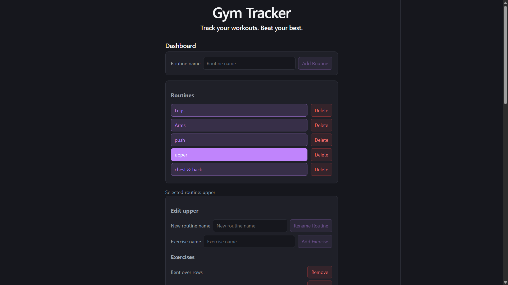
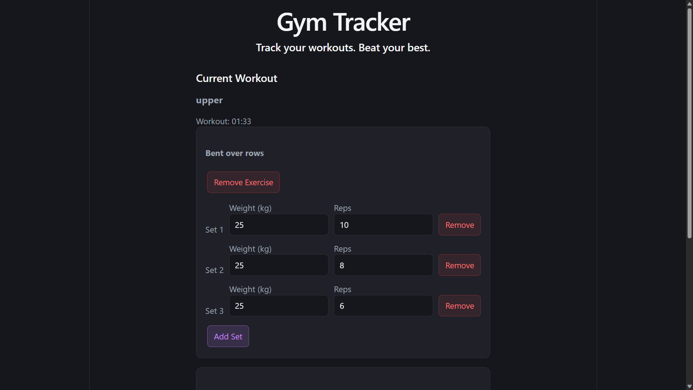
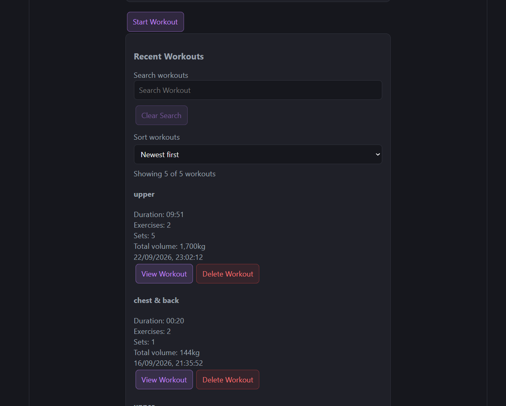
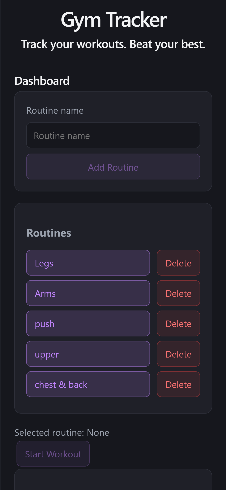

# Gym Tracker

A responsive React application for creating workout routines, recording sets, and reviewing workout history.

I built this project to practise React state management, component design, form handling, array methods, local storage, validation, and responsive CSS.

## Live Demo

[Open the live Gym Tracker](https://gym-tracker-omega-one.vercel.app/)

## Screenshots

### Dashboard



### Active Workout



### Workout History



### Mobile Layout



## Features

- Create, rename, select, and delete workout routines
- Add and remove exercises from routines
- Record workout sets with weight and reps
- Track workout duration
- Validate set inputs before completing a workout
- Save, exit, resume, or discard an unfinished workout
- View previous workout performance
- Calculate exercise and total workout volume
- Search completed workouts by name
- Sort workout history by newest or oldest
- Store routines and workout history in the browser
- Responsive layout for desktop and mobile

## Built With

- React
- JavaScript
- Vite
- CSS
- Browser `localStorage`
- ESLint
- Vercel

## Getting Started

1. Clone the repository:

   ```bash
   git clone https://github.com/zireael06/gym-tracker.git
   ```

2. Open the project directory:

   ```bash
   cd gym-tracker
   ```

3. Install the dependencies:

   ```bash
   npm install
   ```

4. Start the development server:

   ```bash
   npm run dev
   ```

5. Open the local address displayed in the terminal.

## Available Scripts

Start the development server:

```bash
npm run dev
```

Create a production build:

```bash
npm run build
```

Check the project with ESLint:

```bash
npm run lint
```

Preview the production build:

```bash
npm run preview
```

## Data Storage

The app stores routines, completed workouts, and unfinished workout progress in browser `localStorage`.

Data remains in the current browser on the current device and is not synced to an online account.

## Project Structure

```text
gym-tracker/
├── public/
│   └── favicon.svg
├── screenshots/
│   ├── active-workout.png
│   ├── dashboard.png
│   ├── history.png
│   └── mobile.png
├── src/
│   ├── assets/
│   │   └── hero.png
│   ├── components/
│   │   ├── Dashboard.jsx
│   │   ├── Exercise.jsx
│   │   ├── Header.jsx
│   │   ├── RoutineManager.jsx
│   │   ├── Workout.jsx
│   │   └── WorkoutHistory.jsx
│   ├── App.jsx
│   ├── index.css
│   └── main.jsx
├── README.md
├── eslint.config.js
├── index.html
├── package.json
└── vite.config.js
```

The interface is divided into focused React components:

- `Dashboard` manages shared routine and workout state
- `RoutineManager` handles routine creation and editing
- `Workout` manages the active workout
- `Exercise` displays and updates exercise sets
- `WorkoutHistory` displays, searches, sorts, and opens completed workouts
- `Header` displays the application title and supporting text

## Current Status

The main workout-tracking flow is complete and the app is deployed on Vercel.

I am continuing to improve reliability, automated testing, accessibility, and visual polish.